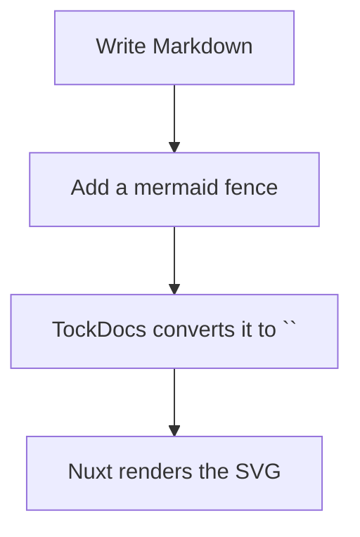
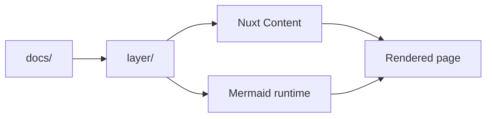
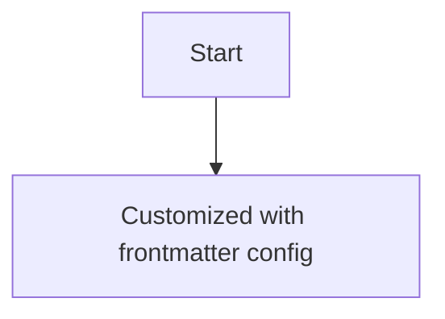

## Mermaid is already enabled

TockDocs registers `@barzhsieh/nuxt-content-mermaid` in the shared layer, so any Markdown page under `docs/content/**` can render Mermaid fences.

You do **not** need to add a separate Vue component for the common case. Just write a top-level Mermaid fence in your content file and the layer will turn it into a responsive diagram.

## Create your first diagram



## Build diagrams that fit TockDocs

A simple TockDocs example:



You can also use sequence diagrams, state diagrams, class diagrams, and more — anything Mermaid supports.

## Customize a diagram per page

TockDocs exposes a `config` frontmatter field for Mermaid overrides. The shared layer already declares this field in `layer/content.config.ts`, so it is parsed as an object.

```md
---
title: Mermaid diagrams
config:
  theme: forest
  flowchart:
    curve: step
---
```



## Useful tips

- Keep the fence name exactly `mermaid`
- Put the fence at the top level of the Markdown file
- Use valid Mermaid syntax; a single typo can trigger `⚠️ Mermaid Diagram Error`
- If you change module configuration, restart the dev server so Vite can re-optimize dependencies

## When to use it

Use Mermaid when you want to explain:

- workspace structure
- request or data flow
- architecture decisions
- onboarding steps
- deployment paths
