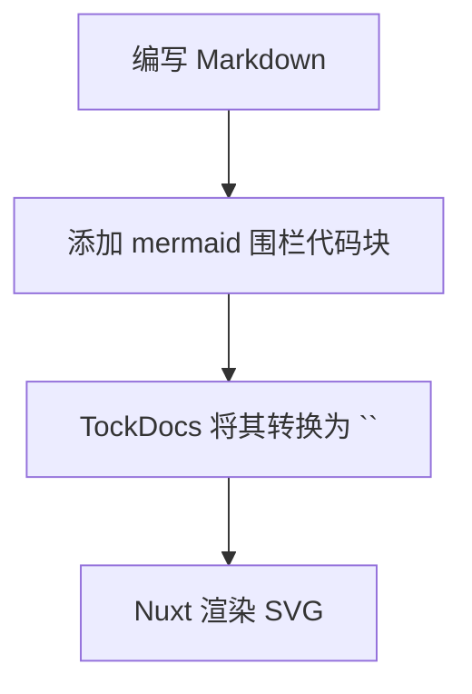
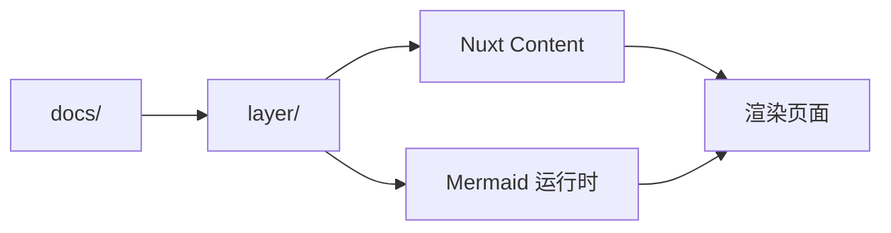
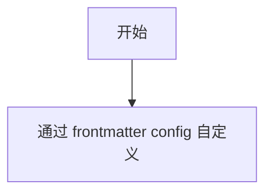

## Mermaid 已默认启用

TockDocs 在共享层中注册了 `@barzhsieh/nuxt-content-mermaid`，因此 `docs/content/**` 下的任何 Markdown 页面都可以渲染 Mermaid 围栏代码块。

常见情况下，您**不需要**添加单独的 Vue 组件。只需在内容文件中编写顶层 Mermaid 围栏代码块，层就会将其转换为响应式图表。

## 创建您的第一个图表



## 构建适合 TockDocs 的图表

一个简单的 TockDocs 示例：



您也可以使用时序图、状态图、类图等——Mermaid 支持的任何类型。

## 自定义每页图表

TockDocs 为 Mermaid 覆盖提供了 `config` frontmatter 字段。共享层已经在 `layer/content.config.ts` 中声明了此字段，因此它会被解析为对象。

```md
---
title: Mermaid 图表
config:
  theme: forest
  flowchart:
    curve: step
---
```



## 实用提示

- 围栏代码块名称必须精确为 `mermaid`
- 将围栏代码块放在 Markdown 文件的顶层
- 使用有效的 Mermaid 语法；一个拼写错误就可能导致 `⚠️ Mermaid Diagram Error`
- 如果更改了模块配置，请重启开发服务器以便 Vite 重新优化依赖

## 何时使用

当您想要说明以下内容时使用 Mermaid：

- 工作空间结构
- 请求或数据流
- 架构决策
- 入门步骤
- 部署路径
